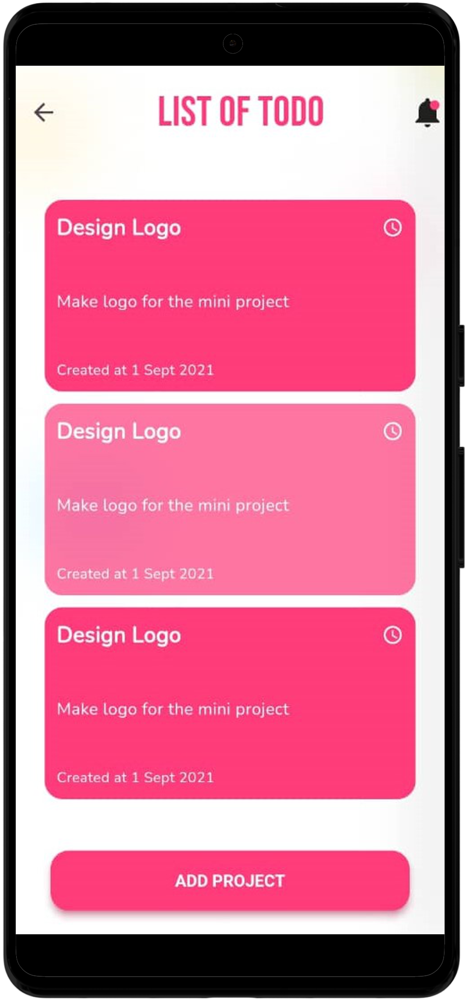
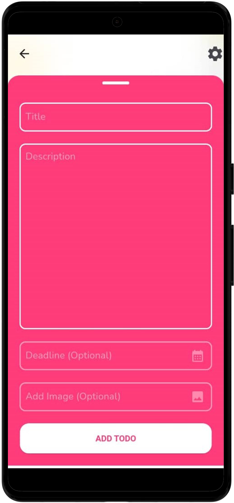

  
# Todo List UI Idea

  <a href="#page_with_curl-about">About</a>&nbsp;&nbsp;&nbsp;|&nbsp;&nbsp;&nbsp;
  <a href="#thought_balloon-inspiration">Inspiration</a>

# :page_with_curl: About

 This repository contains a monorepo of a simpleTODO list idea.

# :thought_balloon: Inspiration
- Design inspired by [App design](https://www.youtube.com/watch?v=BtdEGLrEDn8&pp=ygURZmx1dHRlciBhbmltZSBhcHA%3D) mabe by [Coder HQ](https://github.com/CoderrHQ).

 Made with ❤️ by WKN 👋🏻 

